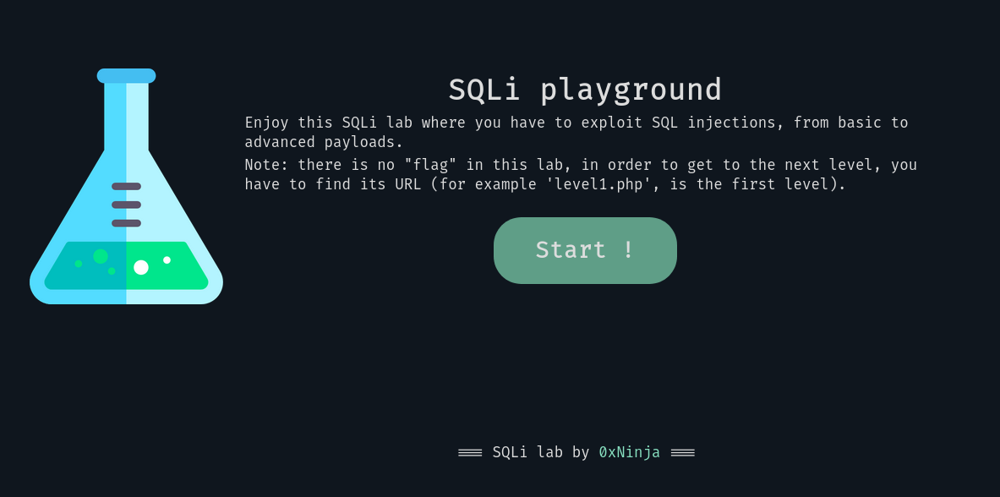

# SQLi-lab
An SQL injection playground, from basic to advanced

## How to use

* Clone the repo
* `docker-compose up --build`
* `firefox http://172.16.0.2`
* Start hacking !

> Tip: add it to your hosts file : `echo '172.16.0.2 sqli.lab' >> /etc/hosts && firefox http://sqli.lab` :smiley:

## IDK

It's recommended to **not** read the source code. If you are stuck : `Inspect element` for (big) nudges.

